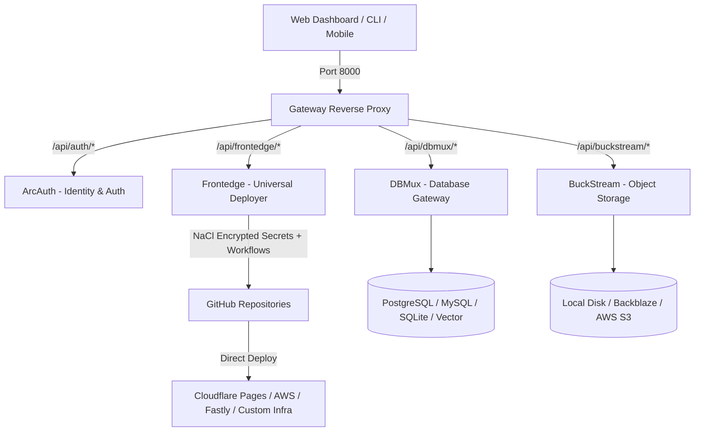

# 🚀 ArcOps — Open-Source Cloud-Native Developer Platform

**ArcOps** is an all-in-one open-source PaaS platform that combines **Universal Deployment Engine**, **Object Storage**, **Multi-Database Multiplexing**, **Identity & Authentication**, and a **Unified Reverse Proxy** into a single, cohesive developer ecosystem.

---

## 🎯 Project Mission: Eliminating Commercial PaaS Markups & Vendor Lock-In

Commercial PaaS providers charge **massive bandwidth markups ($40–$55+ per 100 GB)** for what is essentially a 30-second setup wrapper around raw cloud infrastructure.

* **Identical Setup Friction (30 Seconds)**: Connecting a repo to ArcOps Frontedge takes the exact same 30 seconds as commercial PaaS platforms.
* **$0 Bandwidth Fees**: ArcOps Frontedge deploys your applications directly to Tier-1 CDNs like **Cloudflare Pages ($0 bandwidth fees)**, **AWS CloudFront**, and **Fastly**.
* **Run ANY Custom Workflow (Frontend, Backend & Microservices)**: Simply modify `workflow_template.yml` and secret variables in Go to run **any custom build pipeline** (React, Next.js, Go APIs, Rust binaries, Docker containers).

---

## 📚 Microservice Documentation Index

Each microservice in ArcOps is fully decoupled, self-contained, and has its own dedicated documentation:

| Microservice | README Link | Brief Overview |
| :--- | :--- | :--- |
| ⚡ **Frontedge** | [frontedge/README.md](file:///home/parth/Documents/coding_notes_vscode/open-source-forks/arcops_1.0/Arcops_1.0/frontedge/README.md) | **Universal Deployment Engine**: Run **any custom workflow** (Frontend, Backend, Microservices) on GitHub Actions with NaCl Box secret encryption & custom YAML templates (Cloudflare Pages $0 Egress, AWS, Fastly, Bunny.net, Fly.io). |
| 🔐 **ArcAuth** | [arcauth/README.md](file:///home/parth/Documents/coding_notes_vscode/open-source-forks/arcops_1.0/Arcops_1.0/arcauth/README.md) | **Identity & Auth Microservice**: HttpOnly session security, Bearer API keys, Resend/SMTP Email OTPs, Twilio/Vonage SMS OTPs, GitHub & Google OAuth 2.0. |
| 🗄️ **DBMux** | [dbmux/README.md](file:///home/parth/Documents/coding_notes_vscode/open-source-forks/arcops_1.0/Arcops_1.0/dbmux/README.md) | **Database Multiplexer**: Single TCP socket HTTP/2 ConnectRPC gateway for PostgreSQL, MySQL, SQLite, MongoDB, and Vector DBs with native RLS & IAM auth. |
| 📦 **BuckStream** | [buckstream/README.md](file:///home/parth/Documents/coding_notes_vscode/open-source-forks/arcops_1.0/Arcops_1.0/buckstream/README.md) | **S3 Object Storage**: High-throughput file streaming, presigned URLs, and chunked uploads backing local disk, Backblaze B2, AWS S3, and GCS. |
| 🌐 **Gateway** | [gateway/README.md](file:///home/parth/Documents/coding_notes_vscode/open-source-forks/arcops_1.0/Arcops_1.0/gateway/README.md) | **API Router & Reverse Proxy**: Unified entrypoint (`:8000`) managing path routing (`/api/auth`, `/api/frontedge`, `/api/dbmux`), CORS, and rate-limiting. |
| 🎨 **Web Frontend** | [web/README.md](file:///home/parth/Documents/coding_notes_vscode/open-source-forks/arcops_1.0/Arcops_1.0/web/README.md) | **Unified Dashboard**: React 19 + TypeScript + Vite single-page application featuring Vercel-style deployment console, SQL query builder, and storage explorer. |

---

## 🏛️ Platform Architecture



---

## ⚡ Quick Start

### 1. Clone & Configure Environment
Ensure your environment variables are configured in `deploy/.env`:

```bash
cp deploy/.env.example deploy/.env
```

### 2. Launch Platform Ecosystem
Run the parallel orchestrator script to launch all microservices and database containers:

```bash
./deploy/dev_run.sh
```

### 3. Open Web Console
Navigate to **[http://localhost:3000](http://localhost:3000)** to access the unified dashboard!
